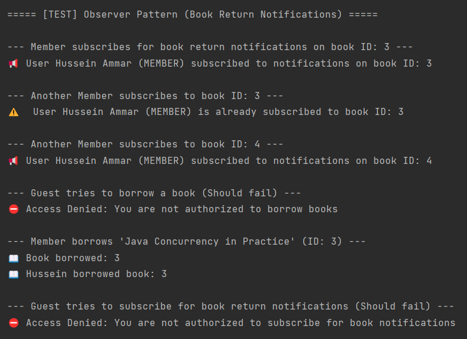

# 📚 LibraShare - Book Sharing System - ConsoleBased

[](https://www.oracle.com/java/technologies/javase/jdk23-archive-downloads.html)
[]()

A **scalable and community-driven** book-sharing system built in **Java**, applying **modern software design patterns** such as **Singleton, Factory, Builder, Proxy, and Observer**. LibraShare helps users **borrow, return, and manage books** efficiently, while promoting **book reuse, accessibility, and community engagement**.
<div align="center">
  <a href="https://github.com/hadialshaer"><strong>View Profile</strong></a>
    <br />
    <br />
    <a href="https://github.com/hadialshaer/LibraShare/issues/new?labels=bug&template=bug_report.md">Report Bug</a>
    ·
    <a href="https://github.com/hadialshaer/LibraShare/issues/new?labels=enhancement&template=feature_request.md">Request Feature</a>
  </p>
</div>

## 📋 Table of Contents

- [Results](#-results)
- [Key Features](#-key-features)
- [Installation Guide](#-installation-guide)
- [Usage](#-usage)
- [Project Structure](#-project-structure)
- [Roadmap](#-roadmap)
- [Contributing](#-contributing)
- [Author](#-author)

## 📊 Results

*Singletone, Factory, Builder and Proxy - test results*


*Observer*


## 🚀 **Key Features**
✅ **User Roles & Permissions**  
- **Guest**: Can only browse books.  
- **Member**: Can **borrow, return, and subscribe** for book return notifications.  
- **Admin**: Full control – can **add, remove, borrow, return books, and manage users**.  

✅ **Design Patterns Implemented**
- **Singleton**: Manages database connection for efficiency.
- **Factory Pattern**: Creates users dynamically based on roles.
- **Builder Pattern**: Used in the User creation process it constructs User objects step-by-step.
- **Proxy Pattern**: Enforces role-based access to book services.
- **Observer Pattern**: Notifies users when a book they requested becomes available.

✅ **Book Borrowing & Availability Notifications**
- Users can **subscribe** to get notified when a book is returned.
- The system automatically **notifies subscribed users** about book availability.

✅ **Secure & Maintainable Code**
- Follows **SOLID principles** and **clean OOP design**.
  
## 🔧 Installation Guide

Clone the repository:
  ```
  git clone https://github.com/hadialshaer/LibraShare.git
  cd LibraShare
  ```

## 🚀 Usage
1. Run the application Main.java
2. Admins can add/remove books.
3. Members can borrow, return, and subscribe for book notifications.
4. Guest can only view books
5. Subscribers get notified automatically when a book is returned.
6. **Enjoy the show 😉**
   

## 📁 Project Structure

```
LibraShare/
│
├── src/com/LibraShare
│   ├── main/                   # Main application entry point
│   ├── models/                 # Book & User models
│   ├── patterns/
│   │   ├── factory/            # Factory Pattern for user creation
│   │   ├── proxy/              # Proxy Pattern for role-based access
│   │   ├── observer/           # Observer Pattern for notifications
│   │   ├── singleton/          # Singleton Pattern for database connection
│   |   |── builder/            # Builder pattern for User creation
│   |──services/                # Add, Borrow, return and some helper methods
|
|── LICENSE
├── README.md
├── .gitignore
```

## 🛣 Roadmap

### 🔜 Future Enhancements:
- **Add JavaFX UI Components:** A graphical user interface for a better user experience.
- **Implement Multi-threading:** Optimize book lending and return processes.
- **Cloud Database Support:** Migrate data to cloud-based storage for scalability.
- **RESTful API Support:** Create a REST API to allow external applications to interact with LibraShare.
- **Improve Security:** Add authentication and authorization layers.
- **Integrate Search Functionality:** Advanced book search and filtering.
- **Deploy Online:** Deploy the project on a cloud platform like AWS or Heroku.

### 🎯 Long-term Vision:
- **Mobile App Integration:** Create an Android/iOS version of LibraShare.
- **Machine Learning for Recommendations:** Suggest books based on user reading patterns.

## 🤝 Contributing

Contributions are what make the open source community such an amazing place to learn, inspire, and create. Any contributions you make are greatly appreciated.
If you have a suggestion that would make this better, please fork the repo and create a pull request. You can also simply open an issue with the tag "enhancement".
Don't forget to give the project a star! Thanks again!

1. Fork the repository
2. Create your feature branch (`git checkout -b feature/AmazingFeature`)
3. Commit your changes (`git commit -m 'Add some AmazingFeature'`)
4. Push to the branch (`git push origin feature/AmazingFeature`)
5. Open a Pull Request

## 👤 Author

**Hadi Alshaer**

- GitHub: [@hadialshaer](https://github.com/hadialshaer)
- reach me: hadialshaer.dev@gmail.com
---

⚠️ **Disclaimer**: This project is open-source under the MIT License. All data is fictional and purely for educational purposes.

